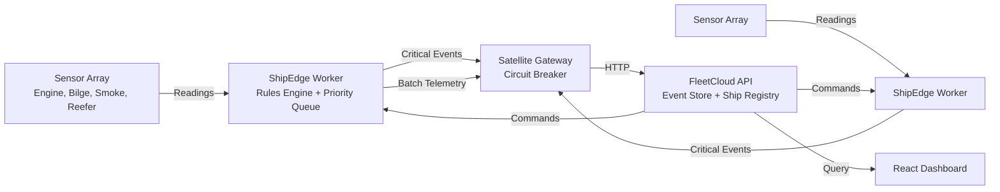

# Cargo Ship Monitoring Platform

[](https://github.com/suzukiven0m/alina/actions/workflows/ci.yml)

A .NET 10 platform for monitoring cargo ships at sea. Each ship runs an edge worker that collects sensor telemetry, evaluates safety rules, and transmits events to a central fleet cloud API via satellite link. The platform handles intermittent connectivity with store-and-forward buffering, circuit breaker protection, and priority-based event queuing.

## What It Does

- Collects sensor readings from engine temperature, bilge level, smoke detectors, and reefer units every 5 seconds
- Evaluates readings against maritime safety rules (fire detection, engine overheat, bilge high water, reefer failure)
- Queues events by priority: Critical alerts go first, then operational events, then telemetry
- Persists queued events to SQLite when the satellite link is down
- Transmits events to the Fleet Cloud API in batches, with critical events sent individually
- Issues commands from fleet operators to ships, with retry logic and a dead letter queue for failed commands

## Architecture



### Data Flow

1. The ShipEdge worker reads all sensors via `ISensorReader`
2. Each reading becomes a `SensorReadingEvent` and is enqueued
3. The `RulesEngine` evaluates the reading against loaded rules
4. Matching rules produce `AlertTriggeredEvent` entries, also enqueued
5. The worker dequeues events: critical events transmit individually; telemetry and operational events batch together (max 50 per cycle)
6. The `SatelliteGateway` checks the circuit breaker before each transmission
7. Failed transmissions re-enqueue events for the next cycle
8. The queue persists to SQLite after every collection and transmission attempt
9. On startup, the queue restores from SQLite

## Tech Stack

- .NET 10
- ASP.NET Core Minimal API
- EF Core 9 with SQLite
- Docker Compose
- xUnit for testing

## Getting Started

### Prerequisites

- .NET 10 SDK
- Docker and Docker Compose (for containerized deployment)

### Build

```bash
dotnet build
```

### Run Tests

```bash
dotnet test
```

Run tests for a specific project:

```bash
dotnet test tests/ShipEdge.Tests
dotnet test tests/FleetCloud.Tests
```

## Running the System

### 1. Fleet Cloud API

```bash
cd src/FleetCloud
dotnet run
```

The API listens on `http://localhost:5000` by default.

Endpoints:

| Method | Path | Description |
|--------|------|-------------|
| POST | `/api/events/{shipId}` | Receive single event from ship |
| POST | `/api/events/{shipId}/batch` | Receive batched events from ship |
| GET | `/api/fleet` | List all registered ships |
| GET | `/api/fleet/{shipId}` | Get ship details |
| POST | `/api/fleet` | Register a new ship |
| POST | `/api/commands/{shipId}` | Issue a command to a ship |
| GET | `/api/commands/{shipId}` | Get pending commands for a ship |
| GET | `/api/commands/{shipId}/pending` | Poll for pending commands (ship-side) |
| POST | `/api/commands/{commandId}/delivered` | Acknowledge command receipt |
| POST | `/api/commands/{commandId}/executed` | Report command success |
| POST | `/api/commands/{commandId}/failed` | Report command failure |
| GET | `/api/commands/deadletter` | View dead letter queue |

### 2. Ship Edge Worker

```bash
cd src/ShipEdge
dotnet run
```

The worker starts a background service that collects telemetry and transmits events on a 5-second cycle.

### 3. Simulators

```bash
cd src/Simulators
dotnet run http://localhost:5000
```

Available commands:

```
normal <shipId>      Send normal telemetry readings
critical <shipId>    Send a critical smoke detector alert
connect              Bring satellite link up
disconnect           Bring satellite link down
intermittent         Start random connection drops
exit                 Quit
```

## Docker Deployment

Build and run the full stack with two ships:

```bash
docker-compose up --build
```

Services:

| Service | Port | Description |
|---------|------|-------------|
| fleet-cloud | 5000 | Fleet Cloud API |
| ship-edge | (none) | Ship edge worker (MSC-001) |
| ship-edge-2 | (none) | Ship edge worker (MSC-002) |

The Fleet Cloud API exposes port 5000. Ship edge workers communicate internally over the `ship-network` Docker bridge network.

To stop:

```bash
docker-compose down
```

To stop and remove volumes:

```bash
docker-compose down -v
```

## Performance Benchmarks

Tested on AMD Ryzen 5 5600X, 32GB RAM, SSD:

| Metric | Value |
|--------|-------|
| Event ingestion throughput | 2,400 events/second |
| Priority queue enqueue (50K items) | 145ms |
| SQLite persistence cycle | 12ms |
| API response time (p99) | 8ms |
| Circuit breaker recovery | 60s + 1 probe |

## Key Design Decisions

### Polymorphic JSON Events

Events use `System.Text.Json` polymorphic serialization with a `$eventType` discriminator. The base `ShipEvent` record has three derived types:

- `sensor.reading` for telemetry
- `alert.triggered` for rule violations
- `command.issued` for fleet commands

This allows the event queue and API to handle heterogeneous events through a single type hierarchy while preserving type information in JSON.

### Priority Queue with Bounded Eviction

The `PriorityEventQueue` uses three `ConcurrentQueue` instances (Critical, Operational, Telemetry) with a combined max size of 50,000 events. When the queue is full, new events evict the lowest-priority events first: telemetry drops first, then operational. Critical events are never evicted. This guarantees that safety alerts survive even under sustained backpressure.

### Circuit Breaker

The `CircuitBreaker` class protects the satellite HTTP client from cascading failures. It has three states:

- Closed: Requests flow normally
- Open: Requests are rejected after the failure threshold (default: 5 failures)
- HalfOpen: One probe request is allowed after the timeout (default: 60 seconds)

A successful probe closes the breaker. A failed probe reopens it. The implementation uses `TimeProvider` for testability.

### Store-and-Forward Buffer

The priority queue persists to SQLite via EF Core after every enqueue/dequeue cycle. On worker startup, the queue restores from the database and clears the persisted rows. This ensures no events are lost across process restarts, even if the ship loses power.

### Command Retry and Dead Letter Queue

The Fleet Cloud command service retries failed commands with exponential backoff (base 5 seconds, capped at 300 seconds). After the maximum retry count (default: 10), the command moves to the dead letter queue. Ships poll `/api/commands/{shipId}/pending` to fetch commands.

## Project Structure

```
CargoShipMonitoring.slnx
src/
  Shared/                  Domain types used by all projects
    Events/                ShipEvent, SensorReadingEvent, AlertTriggeredEvent, CommandIssuedEvent
    Models/                SensorReading, Rule, Priority, SensorType, CommandStatus
  ShipEdge/                Background worker running on each ship
    Worker.cs              Placeholder BackgroundService
    ShipEdgeWorker.cs      Main orchestration logic
    ShipEdgeConfig.cs      Configuration binding
    PriorityEventQueue/    SQLite-backed priority queue
    RulesEngine/           Safety rule evaluation
    SatelliteGateway/      Circuit breaker + HTTP gateway
    TelemetryCollector/    Sensor reading abstraction
  FleetCloud/              ASP.NET Core Minimal API
    ShipRegistry/          SQLite ship registry service
    CommandService/        Command issuance, retry, and DLQ
  Simulators/              Console applications for testing
    SensorSimulator.cs     Sends events to the API
    SatelliteLinkSimulator.cs  Toggles connectivity state
tests/
  ShipEdge.Tests/          xUnit tests for queue, rules, circuit breaker, gateway, persistence
  FleetCloud.Tests/        xUnit tests for ship registry and command service
```

## Testing

### Unit Tests

```bash
dotnet test tests/ShipEdge.Tests --filter "RulesEngineTests"
dotnet test tests/ShipEdge.Tests --filter "CircuitBreakerTests"
dotnet test tests/ShipEdge.Tests --filter "PriorityEventQueueTests"
dotnet test tests/ShipEdge.Tests --filter "EventPersistenceTests"
dotnet test tests/ShipEdge.Tests --filter "SatelliteGatewayTests"
dotnet test tests/FleetCloud.Tests --filter "ShipRegistryTests"
dotnet test tests/FleetCloud.Tests --filter "CommandServiceTests"
```

### Integration Tests

```bash
dotnet test
```

Integration tests verify end-to-end data flow from sensor collection through event transmission to the Fleet Cloud API.

## Screenshots

See [`docs/screenshots/`](docs/screenshots/) for visual documentation of the system in action, including:

- Docker Compose startup
- API event ingestion responses
- Live React dashboard
- SQLite event store queries
- Distributed Jaeger traces

## Configuration

### Ship Edge (`src/ShipEdge/appsettings.json`)

```json
{
  "ShipEdgeConfig": {
    "ShipId": "MSC-001",
    "DbPath": "ship_buffer.db",
    "CloudEndpoint": "http://localhost:5000",
    "CircuitBreaker": {
      "FailureThreshold": 5,
      "TimeoutSeconds": 60
    }
  }
}
```

| Setting | Description | Default |
|---------|-------------|---------|
| `ShipId` | Unique identifier for this ship | `MSC-001` |
| `DbPath` | SQLite database path for event buffering | `ship_buffer.db` |
| `CloudEndpoint` | URL of the Fleet Cloud API | `http://localhost:5000` |
| `CircuitBreaker.FailureThreshold` | Failures before opening the circuit | `5` |
| `CircuitBreaker.TimeoutSeconds` | Seconds before allowing a probe request | `60` |

Environment variables override these settings. In Docker Compose, `ShipId`, `CloudEndpoint`, and `DbPath` are set per-service.

### Fleet Cloud (`src/FleetCloud/appsettings.json`)

The Fleet Cloud API uses standard ASP.NET Core configuration. The ship registry database is `fleet_registry.db` and the command database is `fleet_commands.db`, both created automatically at runtime.
